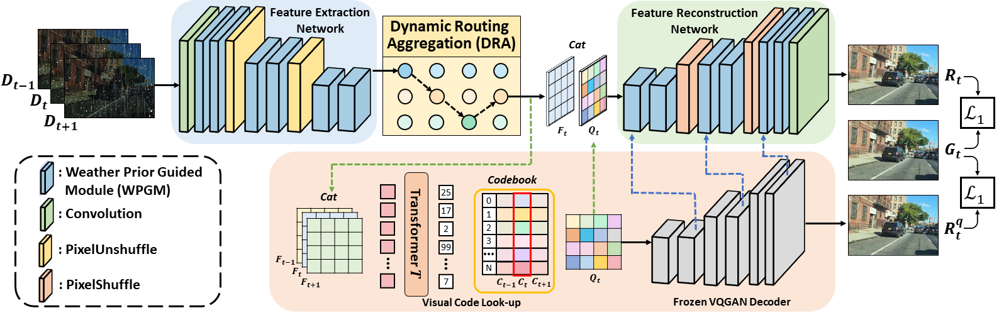

# Removing Multiple Hybrid Adverse Weather in Video via a Unified Model (in submission)


> **Abstract:** *Videos captured under real-world adverse weather conditions 
typically suffer from uncertain hybrid weather efforts. However, existing algorithms can only remove one type of weather degradation at a time and deal with different weather conditions with separate models, thus may fail to handle real-world stochastic hybrid scenarios. Besides, the model training is also infeasible due to the lack of paired video data to characterize the coexistence of multiple weather. In this paper, we have advanced the forementioned limitations from two aspects: model and data. First, we propose a novel unified model, dubbed UniWRV, to remove multiple hybrid adverse weather from video in an all-in-one fashion. Specifically, UniWRV queries scenario-specific weather priors for given instances to adaptively characterizes the intra-frame (spatial) features with weather-heterogeneous degradation morphology and dynamically selects customized aggregation path to adaptively fuse inter-frame (temporal) features with weather-heterogeneous frame-to-frame change patterns. The proposed UniWRV can sufficiently explore the joint sharing mechanism and differential expression mechanism of different weather video features, and adaptively remove uncertain weather degradations with a single model instance.
Second, we construct a new synthetic video dataset, termed HWVideo, for learning and benchmarking multiple hybrid adverse weather removal. HWVideo contains 15 weather conditions composed of an arbitrary combination of four common weather, with a total of 1500 adverse-weather/clean paired video clips. Comprehensive experiments demonstrate that our UniWRV can achieve promising results
on unified multiple hybrid adverse weather removal from video.* 

## Framework Architecture
<table>
  <tr>
    <td>  </td>
  </tr>
  <tr>
    <td><p align="center"><b>Overall Framework of UniWRV</b></p></td>
  </tr>
</table>


## `Installation`
`The model is built in PyTorch 1.1.0 and tested on Ubuntu 16.04 environment (Python3.7, CUDA9.0, cuDNN7.5).`

For installing, follow these intructions
```
conda create -n pytorch1 python=3.7
conda activate pytorch1
conda install pytorch=1.1 torchvision=0.3 cudatoolkit=9.0 -c pytorch
pip install matplotlib scikit-image opencv-python timm einops ptflops PIL argparse
```

## Training
- Download the [dataset](dataset/README.md) and run

```
cd dataset
python prepare.py
```
-  Download the pre-trained [VQGAN] and place it in `./logs/`
-  Train the model with default arguments by running

```
python train.py
```


## Evaluation

1. Download the pre-trained model and place it in `./checkpoints/`

2. Download the dataset and place it in `./datasets/`

3. Run
```
python test.py
```
4. Visual results wii be saved in results


## Real-world Results
<table>
  <tr>
    <td>  </td>
  </tr>
</table>


