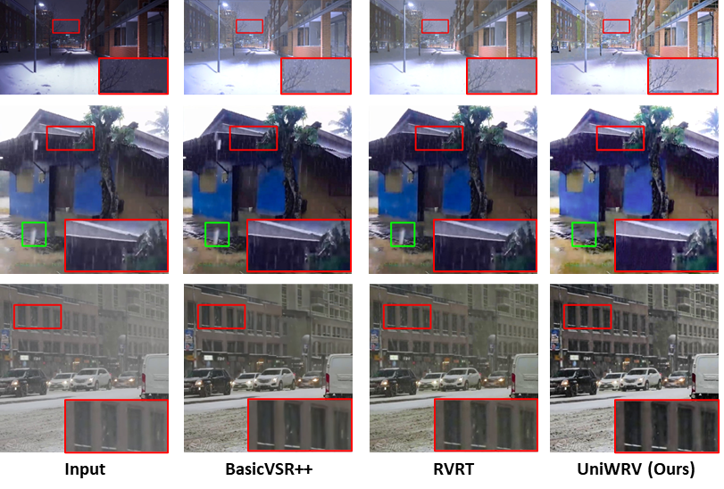

# Removing Multiple Hybrid Adverse Weather in Video via a Unified Model (in submission)

:heart_eyes: :heart_eyes: :heart_eyes: :heart_eyes:  :heart_eyes: :heart_eyes:   Our proposed UniWRV delivers 2.76 dB PSNR performance gains ！！！   :heart_eyes: :heart_eyes:  :heart_eyes: :heart_eyes: :heart_eyes: :heart_eyes:
<p align="center">
    
    

> **Abstract:** *Videos captured under real-world adverse weather conditions typically suffer from uncertain hybrid weather artifacts with heterogeneous degradation distributions. However, existing algorithms only excel at specific single degradation distributions due to limited adaption capacity and have to deal with different weather degradations with separately trained models, thus may fail to handle real-world stochastic weather scenarios. Besides, the model training is also infeasible due to the lack of paired video data to characterize the coexistence of multiple weather. To ameliorate the aforementioned issue, we propose a novel unified model, dubbed UniWRV, to remove multiple heterogeneous video weather degradations in an all-in-one fashion. Specifically, to tackle degenerate spatial feature heterogeneity, we propose a tailored weather prior guided module that queries exclusive priors for different instances as prompts to steer spatial feature characterization. To tackle degenerate temporal feature heterogeneity, we propose a dynamic routing aggregation module that can automatically select optimal fusion paths for different instances to dynamically integrate temporal features. 
Additionally, we managed to construct a new synthetic video dataset, termed HWVideo, for learning and benchmarking multiple hybrid adverse weather removal, which contains 15 hybrid weather conditions with a total of 1500 adverse-weather/clean paired video clips. Real-world hybrid weather videos are also collected for evaluating model generalizability. Comprehensive experiments demonstrate that our UniWRV exhibits robust and superior adaptation capability in multiple heterogeneous degradations learning scenarios, including various generic video restoration tasks beyond weather removal.* 

## Framework Architecture
<table>
  <tr>
    <td>  </td>
  </tr>
  <tr>
    <td><p align="center"><b>Overall Framework of UniWRV</b></p></td>
  </tr>
</table>


## `Installation`
`The model is built in PyTorch 1.1.0 and tested on Ubuntu 16.04 environment (Python3.7, CUDA9.0, cuDNN7.5).`

For installing, follow these intructions
```
conda create -n pytorch1 python=3.7
conda activate pytorch1
conda install pytorch=1.1 torchvision=0.3 cudatoolkit=9.0 -c pytorch
pip install matplotlib scikit-image opencv-python timm einops ptflops PIL argparse
```

## Training
- Download the [dataset](dataset/README.md) and run

```
cd dataset
python prepare.py
```
-  Train the model with default arguments by running

```
python train.py
```


## Evaluation

1. Download the pre-trained model and place it in `./checkpoints/`

2. Download the dataset and place it in `./datasets/`

3. Run
```
python test.py
```
4. Visual results wii be saved in results


## Real-world Results
<table>
  <tr>
    <td>  </td>
  </tr>
</table>


